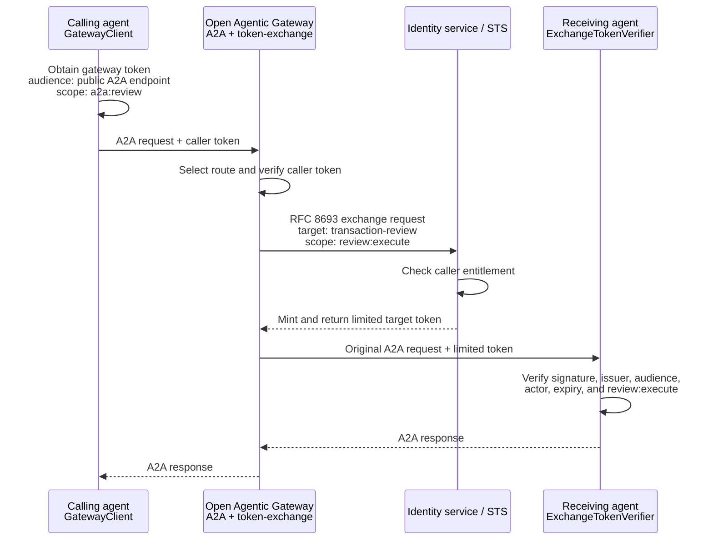
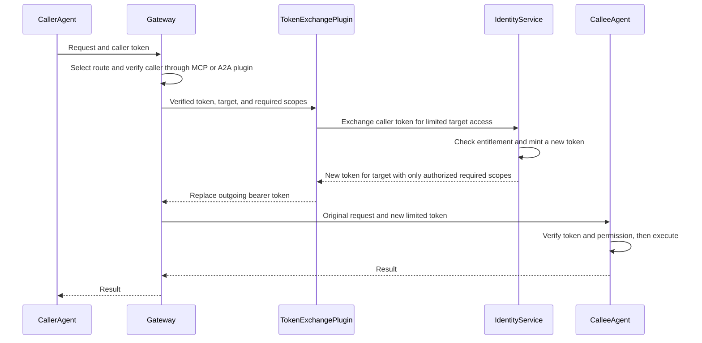
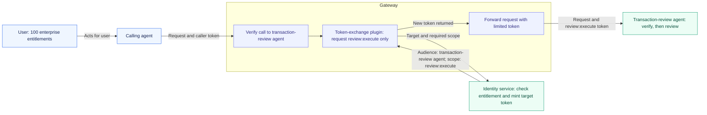

# Open Agentic Gateway

**Build the gateway your agents need. Share the capabilities everyone can use.**

AI agents need tools, other agents, and permission to act. As workflows grow, teams also need to understand what happened across those connections, control usage, and decide where requests should go. These shared concerns recur across projects.

Open Agentic Gateway is a place to solve those problems together. It provides an open gateway built on Kong OSS, with reusable plugins for MCP, A2A, and token exchange. Run it for your own workflows, improve an existing capability, or contribute the next plugin.

**Have a shared problem across your agents? Build a plugin here.** Tracing agent-to-agent calls, enforcing usage budgets, discovering tools, or choosing an LLM are examples of capabilities the community could contribute. Today's working foundation covers MCP, A2A, and token exchange.

[Try it](examples/banking/README.md) · [Build with us](CONTRIBUTING.md) · [Propose a capability](https://github.com/sanketrk/Open-Agentic-Gateway/issues/new) · [Deploy it](docs/gateway/setup.md)

## Bring AI gateway capabilities to the open-source community

Kong OSS gives developers an extensible gateway foundation. Several capabilities needed for AI and agent workflows—including Kong's [AI MCP Proxy](https://developer.konghq.com/plugins/ai-mcp-proxy/), [AI A2A Proxy](https://developer.konghq.com/plugins/ai-a2a-proxy/), and [AI Proxy Advanced](https://developer.konghq.com/plugins/ai-proxy-advanced/)—require a commercial AI license. They are separate from the plugins available in Kong OSS.

**That gap is the motivation for Open Agentic Gateway: build AI and agent gateway capabilities that the community can use, inspect, improve, and share as open source.**

We are building independent Apache-2.0 plugins on Kong OSS. MCP, A2A, and token exchange are the starting point. Agent-to-agent observability, access policy, usage controls, discovery, and routing are opportunities to build together. When someone solves a shared problem here, other teams can reuse and extend that contribution.

Kong has also published some AI plugin source, such as the [basic AI Proxy in its OSS repository](https://github.com/Kong/kong/tree/3.9.0/kong/plugins/ai-proxy). The gap described here concerns the commercially licensed capabilities above.

[Build an open capability with us →](CONTRIBUTING.md)

## Why build here?

A useful solution should be able to travel beyond the team that created it. An interoperability fix, an access policy, or a routing strategy can become a reusable plugin that helps other projects.

This repository gives contributors a starting point: a working gateway, three plugins, a Python SDK, an administrator UI, and banking examples tested through real token exchange. You can work on one capability and demonstrate it alongside the others.

| For builders | For teams running agents |
| --- | --- |
| Read, adapt, and contribute Apache-2.0 source. | Host the gateway in your own infrastructure. |
| Add a focused plugin using Kong's extension mechanism. | Choose capabilities per connection. |
| Use shared examples and CI to demonstrate your change. | Connect tools and agents through a common entry point. |
| Share integrations across open protocols and agent stacks. | Keep backend credentials and access policy at the gateway. |

The aim is an open collection of useful gateway capabilities that grows through contributions. The current project is a starting point you can use and extend.

## What is available today?

| Component | What you can do |
| --- | --- |
| `mcp` plugin | Connect agents to MCP tools and check incoming access. |
| `a2a` plugin | Connect agents to other agents over JSON-RPC or REST and check incoming access. |
| `token-exchange` plugin | Obtain a separate backend token with the configured permissions. |
| Python SDK | Call the gateway and verify the required identity policy at backends. |
| Control plane | Register MCP servers and A2A agents, assign token-exchange policies, review configuration, and publish it with OIDC administrator login. |

The control plane manages MCP, A2A, and token-exchange settings in one publication workflow. The same settings can also be managed as deployment configuration. See the [supported profiles](docs/protocols/interoperability.md), [A2A guide](docs/protocols/a2a.md), and [SDK guide](sdk/python/README.md) for current limits.

## Gateway comparison with Apigee

Last source review: **2026-10-05**. This compares proxying external MCP servers and A2A agents. It does not compare protocol-server implementations or claim universal conformance. Vendor features change; re-check the linked primary documentation before selecting a product or publishing an updated comparison.

A gateway routes requests, authenticates callers, applies access policy, preserves protocol data and streaming responses, handles disconnects/timeouts, and optionally exchanges credentials. MCP sampling/elicitation, resource contents, subscription management, and A2A task storage/execution belong to clients and upstream servers. Their absence from a gateway is not itself a proxy support gap.

| Gateway responsibility | Open Agentic Gateway | Apigee / Apigee X | Apigee hybrid |
| --- | --- | --- | --- |
| MCP HTTP routing | Dedicated MCP plugin and per-server protected resources | Configured API proxies to external MCP backends | Same proxy approach |
| A2A JSON-RPC / REST routing | Dedicated A2A plugin; explicit 1.0 REST operation paths | Configured API proxies to agent endpoints | Same proxy approach |
| SSE response forwarding | Unbuffered; tested through real Kong | Native SSE support | Native SSE support in 1.15.0+ |
| MCP protocol validation | Explicit version, envelope, metadata/header, Origin, and Accept checks | Equivalent checks require configured policies; a complete built-in profile was not established by the documentation reviewed | Same qualification |
| A2A protocol validation | Explicit version/envelope checks and REST path/method validation | Equivalent checks require configured policies | Same qualification |
| Caller identity and permissions | Configured JWT issuer, audience, algorithm, and scope checks | Configured JWT/OAuth policies | Same policy approach |
| Target-specific token exchange | Packaged RFC 8693 plugin and route resource/scope mapping | Implement using policies and an external STS callout | Same approach |
| Disconnects, timeouts, event order | Selected configurations verified by integration tests | Validate the selected proxy/policy/deployment configuration | Same qualification |
| A2A gRPC binding | Not implemented | Unary gRPC passthrough documented; does not establish streaming-binding support | gRPC API proxies documented as unsupported |

Apigee's documented foundations are [SSE streaming](https://docs.cloud.google.com/apigee/docs/api-platform/develop/server-sent-events), [VerifyJWT](https://docs.cloud.google.com/apigee/docs/api-platform/reference/policies/verify-jwt-policy), and [ServiceCallout](https://docs.cloud.google.com/apigee/docs/api-platform/reference/policies/service-callout-policy). Mapping these building blocks to our exact protocol and STS policies is an architectural assessment, not evidence of a tested equivalent deployment. Its [gRPC proxy documentation](https://docs.cloud.google.com/apigee/docs/api-platform/fundamentals/build-simple-api-proxy#creating-grpc-api-proxies) limits support to unary passthrough and excludes hybrid.

Apigee Edge separately documents [HTTP request/response streaming](https://docs.apigee.com/api-platform/develop/enabling-streaming). Policies that inspect payloads may cause buffering or errors. Do not assume Edge has the same SSE/EventFlow capabilities as modern Apigee, or claim complete MCP/A2A coverage without testing its actual deployment.

Apigee's built-in MCP server is a separate feature: [hybrid 1.17.0+](https://docs.cloud.google.com/apigee/docs/api-platform/apigee-mcp/enable-mcp) can expose existing APIs as tools. The [MCP overview](https://docs.cloud.google.com/apigee/docs/api-platform/apigee-mcp/apigee-mcp-overview) documents its methods and limitations, including the currently stated SSE limitation. Those server limitations do not establish limitations of an API proxy in front of an external MCP server.

Open Agentic Gateway packages a focused, inspectable protocol/identity profile and reproducible tests. Apigee supplies a broader API-management platform from which an equivalent HTTP gateway profile can be assembled. Our CI evidence verifies our selected configuration; it does not prove Apigee cannot match it or establish production capacity for this project. See the [streaming suite](docs/gateway/setup.md#gateway-streaming-integration-tests) for the exact boundary and deployment checks.

## Tracking MCP and A2A revisions

Tracking is currently **manual and review-driven**. CI verifies the committed protocol profiles; it does not fetch specifications, detect new upstream versions, or automatically upgrade protocol support. A protocol named `latest` in an external URL does not change the gateway's accepted versions.

### Reviewed support inventory

Inventory reviewed: **2026-10-05**. These are implemented project profiles, not a promise to accept every future upstream release.

| Component | Implemented profile | Evidence and limits |
| --- | --- | --- |
| MCP gateway | `2026-07-28`; configurable legacy `2025-11-25` and `2025-03-26` | [Handler](gateway/plugins/mcp/handler.lua), [schema](gateway/plugins/mcp/schema.lua), [unit checks](tests/handler_spec.lua); current POST/SSE and subscription transport tested through Kong |
| A2A gateway | `1.0` JSON-RPC and HTTP+JSON/REST; legacy `0.3` JSON-RPC | [Handler](gateway/plugins/a2a/handler.lua), [schema](gateway/plugins/a2a/schema.lua), [unit checks](tests/a2a_spec.lua); 1.0 streaming paths tested through Kong; no gRPC or tenant-prefixed REST routing |
| Python SDK and banking MCP servers | `2025-11-25` stateless initialization/tool profile with JSON or POST SSE | [SDK profile](sdk/python/README.md#current-profile); no current-revision MCP lifecycle, MRTR, persistent sessions, or resumption |
| Python SDK and banking A2A agent | `1.0` synchronous SendMessage, JSON-RPC and REST | [SDK profile](sdk/python/README.md#current-profile); A2A streaming/task lifecycle is outside this SDK profile |

Gateway support and SDK/demo support are tracked separately. Forwarding an extension payload is not the same as testing its full client/server interaction. The [independent streaming fixtures](tests/streaming/test_gateway.py) validate transport, policy, and forwarding boundaries; they are not complete conforming protocol servers.

### Upstream sources to review

Use the official [MCP specification](https://modelcontextprotocol.io/specification/) and [MCP project](https://github.com/modelcontextprotocol/modelcontextprotocol), plus the official [A2A specification](https://a2a-protocol.org/latest/specification/) and [A2A releases](https://github.com/a2aproject/A2A/releases), to identify published revisions and changes. Review stable releases separately from proposals, draft SEPs, and development-branch changes.

For the committed profiles, use versioned references: [MCP 2026-07-28 Streamable HTTP](https://modelcontextprotocol.io/specification/2026-07-28/basic/transports/streamable-http), [MCP authorization](https://modelcontextprotocol.io/specification/2026-07-28/basic/authorization), and [A2A 1.0 specification](https://a2a-protocol.org/v1.0.0/specification/). Record a versioned URL and upstream tag/commit when available in the compatibility review so future changes to a `latest` page do not silently redefine the acceptance criteria.

### Maintainer revision workflow

Before a project release and whenever adopting a newly published protocol revision:

1. Open a compatibility issue or PR recording the upstream revision, source URLs/tag/commit, review date, and affected bindings. Classify each change as gateway-required, upstream/client-owned, or outside our supported profile.
2. Review method/path mapping, media types, version negotiation, metadata headers, discovery, authorization, errors, streams, disconnect/cancellation, and backward compatibility. Do not add a version to an allowlist before checking its wire behavior.
3. Update affected handlers/schemas, the control-plane validator/configuration generator/UI, sample configurations and embedded OpenShift configuration. Update the SDK and examples only when their profiles are being expanded; otherwise explicitly retain their narrower inventory entries.
4. Add positive and negative unit/runtime checks for changed boundaries. Extend the real-Kong streaming suite when stream delivery, subscriptions, cancellation, bindings, or exchange behavior changes. Keep legacy-profile regression tests when retaining compatibility.
5. Run the relevant checks and [CI workflow](.github/workflows/ci.yml), including real gateway integration tests. Record which behaviors were tested, merely passed through, or not supported. External SDK/server interoperability needs its own evidence; fixture success alone is not conformance certification.
6. Update this inventory and its review date, the protocol guides, migration guidance, and comparison review date if vendor claims changed. Link the compatibility PR to the supporting CI run. Advertise only profiles actually implemented and tested; deployment ingress and load limits remain separately verified.

This workflow maintains explicit support claims while allowing contributors to report new revisions. Automatic monitoring or scheduled upstream checks can be added later; none are configured by this documentation change.

## How an agent uses the gateway

The intended application architecture uses the SDK at both ends of a connection:

- The **calling agent** uses `GatewayClient` to call another agent over A2A or invoke an MCP tool through the gateway.
- The **receiving agent or MCP server** uses `ExchangeTokenVerifier` before executing business logic.

The SDK is a convenience and policy-enforcement library, not a proprietary wire protocol. A standards-compatible A2A or MCP client can call the gateway without it, and a backend can use another JWT library if it enforces the same issuer, audience, scope, actor, signature, and expiry checks.

### Who decides the scope and who creates the token?

The gateway does not invent a scope from the request, and it does not sign tokens.

| Responsibility | Component |
| --- | --- |
| Register the target and configure its required caller scope | Administrator through the control plane |
| Map that route to a backend resource and backend scopes | Token-exchange policy stored with the route |
| Obtain a token for calling the public gateway endpoint | Calling agent, normally through `GatewayClient` and its token provider |
| Verify the caller token and select the registered route | Gateway `a2a` or `mcp` plugin |
| Request a target-specific token using the route policy | Gateway `token-exchange` plugin |
| Authorize the exchange and mint the new token | Trusted identity service or Security Token Service (STS) |
| Verify the exchanged token before execution | Receiving agent or MCP server, normally through `ExchangeTokenVerifier` |

For example, the transaction-review route has an explicit mapping:

| Policy value | Example |
| --- | --- |
| Public gateway endpoint | `/a2a/transaction-review` |
| Caller token audience | `https://gateway.example.com/a2a/transaction-review` |
| Caller must have | `a2a:review` |
| Exchange target | `urn:bank:backend:transaction-review` |
| New token receives | `review:execute` |

The request then follows these exact steps:

1. `GatewayClient.send_message()` asks the configured token provider for a caller token containing the gateway audience and `a2a:review`.
2. The SDK sends the A2A request and caller token to `/a2a/transaction-review` on Open Agentic Gateway.
3. The `a2a` plugin verifies the caller token and makes the verified identity available to the `token-exchange` plugin.
4. The `token-exchange` plugin reads the route's configured target and scopes. It sends the caller token, `urn:bank:backend:transaction-review`, and `review:execute` to the STS using RFC 8693.
5. The STS decides whether the caller may receive that access. If allowed, **the STS mints and signs** a new token limited to the transaction-review agent.
6. The gateway replaces the outbound bearer token with the new token and forwards the original A2A request.
7. The receiving agent verifies the new token with `ExchangeTokenVerifier` and then executes the request.



The receiving agent never sees the original caller token or unrelated caller permissions.

Install the SDK directly from this repository while it is under development:

```sh
python3 -m pip install -e sdk/python
```

### Agent calls another agent over A2A

The calling agent supplies the gateway URL, its OAuth client credentials, and the public A2A endpoint registered in the control plane:

```python
from open_agentic_gateway import Endpoint, GatewayClient, OAuthClientCredentials

tokens = OAuthClientCredentials(
    token_endpoint="https://identity.example.com/oauth/token",
    client_id="banking-orchestrator",
    client_secret="read-from-a-secret-store",
    ca_file="/credentials/ca.pem",
)

gateway = GatewayClient(
    gateway_url="https://gateway.example.com",
    token_provider=tokens,
    ca_file="/credentials/ca.pem",
)

review_agent = Endpoint(
    path="/a2a/transaction-review",
    audience="https://gateway.example.com/a2a/transaction-review",
    scopes=("a2a:review",),
    protocol="a2a",
)

response = gateway.send_message(
    review_agent,
    "Summarize synthetic merchant purchase DEMO-TX-003.",
)
```

`send_message()` obtains the caller token and sends an A2A 1.0 JSON-RPC request through the gateway. The token-exchange plugin requests the route's configured target access, and the STS returns a newly signed token with:

```text
subject:  banking-orchestrator
actor:    banking-gateway
audience: urn:bank:backend:transaction-review
scope:    review:execute
```

For the A2A HTTP+JSON/REST binding, use the REST path and binding:

```python
review_agent_rest = Endpoint(
    path="/a2a/transaction-review/rest",
    audience="https://gateway.example.com/a2a/transaction-review",
    scopes=("a2a:review",),
    protocol="a2a",
    binding="HTTP+JSON",
)

response = gateway.send_message(review_agent_rest, "Review DEMO-TX-003.")
```

### Agent calls one or more MCP servers

The same client can call a tool through an MCP connection. The SDK reads the gateway's protected-resource metadata, obtains the correct token, performs the MCP initialization sequence, confirms that the tool is advertised, and calls it:

```python
accounts = Endpoint(
    path="/mcp/accounts",
    audience="https://gateway.example.com/mcp/accounts",
    scopes=("accounts:read",),
    protocol="mcp",
)

account = gateway.call_tool(
    accounts,
    "get_account_summary",
    {"account_id": "DEMO-001"},
)
```

An agent can call several MCP servers with separate endpoint policies. It receives a different gateway token for each audience, and the token-exchange plugin asks the STS for a different downscoped backend token for each target:

```python
transactions = Endpoint(
    path="/mcp/transactions",
    audience="https://gateway.example.com/mcp/transactions",
    scopes=("transactions:read",),
    protocol="mcp",
)

account = gateway.call_tool(accounts, "get_account_summary", {"account_id": "DEMO-001"})
recent = gateway.call_tool(transactions, "list_recent_transactions", {"account_id": "DEMO-001"})
```

The accounts server receives only `accounts:summary` for `urn:bank:backend:accounts`. The transactions server receives only `transactions:recent` for `urn:bank:backend:transactions`. Neither server receives the other server's permission.

### The target verifies the exchanged token

The receiving agent or MCP server uses the SDK verifier before dispatching business logic. This is where the target enforces that the STS signed the token for this exact audience and scope and named the expected gateway actor:

```python
from open_agentic_gateway import ExchangeTokenVerifier

verifier = ExchangeTokenVerifier(
    issuer="https://identity.example.com/",
    audience="urn:bank:backend:transaction-review",
    scopes=("review:execute",),
    gateway_actor="banking-gateway",
    jwks=trusted_jwks,
)

claims = verifier.verify(request.headers.get("Authorization"))
# Execute only after signature, issuer, audience, actor, expiry, and scope pass.
```

The complete runnable implementation is in the [banking orchestrator](examples/banking/banking-orchestrator/orchestrator.py), [receiving A2A agent](examples/banking/transaction-review-agent/review_agent.py), [accounts MCP server](examples/banking/accounts-mcp-server/accounts_server.py), and [transactions MCP server](examples/banking/transactions-mcp-server/transactions_server.py).

### Use these plugins with Kong OSS

Our `mcp`, `a2a`, and `token-exchange` plugins are Apache-2.0 source available in this repository. They run on Kong OSS without a Kong Enterprise or AI license. The supplied image includes them alongside the OSS release's bundled plugins.

Compatible OSS plugins can be configured alongside them; check version support and how they interact. Each upstream plugin retains its own license. See the [Kong Plugin Hub](https://developer.konghq.com/plugins/) for upstream availability and our [contribution guide](CONTRIBUTING.md) for extending the gateway.

## Plugins make room for your next idea

Choose the behavior a connection needs. An MCP route uses the tool plugin; an A2A route uses the agent plugin. Either can add the same token-exchange plugin. That shared capability can improve without rebuilding both protocols.



The same exchange plugin serves MCP and A2A routes. The callee receives the new token for its own audience and required scopes. The original caller token is used for exchange and is not forwarded to the callee. If verification or exchange fails, the request is blocked. Token exchange is optional in the base gateway.

A new capability can follow the same approach: a focused plugin, clear configuration, and an example others can run. Contributors implement, package, and test new plugins using Kong's plugin mechanism. The [contribution guide](CONTRIBUTING.md#adding-a-plugin) explains the steps.

### Build capabilities that work across workflows

An agent calling another agent creates questions that every team needs to answer: Who called whom? Which step was slow? Why did the workflow fail? What access was used? Solving those questions in a shared gateway can make the solution reusable across many agents and tools.

These are **cross-cutting concerns**: capabilities that support many workflows. Plugins give contributors a place to develop them independently and compose them with the protocol and access checks already here.

| A shared need | A contribution could enable |
| --- | --- |
| Agent-to-agent observability | Link related calls, show the path between agents, and explain latency and failures. |
| Access policy and audit | Apply additional access rules and record who called which service with what permission. |
| Usage and cost controls | Enforce configured limits or budgets across agent and tool calls. |
| Discovery and routing | Find approved agents and tools, or select an appropriate destination. |
| Model selection | Route model requests using cost, latency, capability, or data-location policy. |
| Administration and integration | Extend the control plane, support more SDK languages, and add identity integrations. |

For example, an observability contribution could demonstrate a trace across two agents and a tool call. An LLM-routing contribution could select between two approved models using a clear policy. Both start with a concrete problem and an example others can reproduce.

**These are contribution directions, not additional features shipped today.** Each needs its own design, configuration, implementation, and tests. The gateway can observe traffic that passes through it; complete workflow traces also need cooperating agents and services.

[Open a proposal](https://github.com/sanketrk/Open-Agentic-Gateway/issues/new) with the problem and a concrete workflow. Documentation fixes, bug reports, and interoperability tests are equally useful contributions. The [contribution guide](CONTRIBUTING.md) explains how to start.

## Give each target only the access it needs

A user may have **100 enterprise entitlements**. A transaction-review agent may need **just one**: `review:execute`.

The gateway invokes the token-exchange plugin to obtain a new token for that target, carrying only the permission required for the call. This is **downscoping**. The plugin requests that access from your trusted identity service, which checks the caller's entitlement and mints the token. The gateway forwards the request with the new token; the callee verifies it before execution.



**With this issuance policy, the transaction-review agent receives only `review:execute` for its own audience.** Permissions for payments, customer administration, and unrelated services are excluded from that token. The identity service must enforce this scope limit. The backend SDK checks for required permissions; it does not reject additional signed scopes. With the appropriate identity policy, the callee can also identify the original caller and the gateway acting for them.

The permission set must be relevant to the target and operation. Today, the plugin requests scopes configured for the selected route; the identity service must enforce the narrow issuance policy. Automatic selection of scopes from individual request content is a future policy extension. The [token-exchange guide](docs/plugins/token-exchange.md) covers setup and enforcement.

## Try the banking scenarios

The examples contain **two agents and two MCP servers**. The orchestrator is a command-line A2A/MCP client; the review agent exposes an A2A server. Separate scenarios demonstrate account reads, transaction reads, and a fixed transaction-review response. The review agent does not consume the MCP results. Each target receives its own limited token.

The runnable demo uses the calling agent's machine identity and fixed per-route scope mappings. The 100-entitlement user case above illustrates an identity policy for a deployment; the demo does not include a human login or user-entitlement directory. Fixture tests also check that exchanging a synthetic 100-scope subject token issues only the target's one scope.

The examples use synthetic data and include a local identity service, TLS, and both A2A JSON-RPC and REST. [Run them locally →](examples/banking/README.md)

## Get started

```sh
git clone https://github.com/sanketrk/Open-Agentic-Gateway.git
cd Open-Agentic-Gateway
```

| Start here | Guide |
| --- | --- |
| Run the banking scenarios | [Banking examples](examples/banking/README.md) |
| Contribute a fix or capability | [Contributing](CONTRIBUTING.md) |
| Configure and deploy | [Gateway setup](docs/gateway/setup.md) |
| Manage gateway connections and policies | [Control-plane setup](docs/control-plane/setup.md) |
| Explore the code | [Gateway plugins](gateway/plugins/), [SDK](sdk/python/), [control plane](apps/control-plane/), [tests](tests/) |
| Find all guides | [Documentation index](docs/README.md) |

You supply the services, identity configuration, and deployment environment. Backends own their business logic and authorization. Production deployments also need network restrictions, monitoring, and operational policies.

## License

Use, modify, and contribute under [Apache-2.0](LICENSE). Built on Kong Gateway OSS and OpenResty. The [gateway setup guide](docs/gateway/setup.md) covers dependency licenses.
